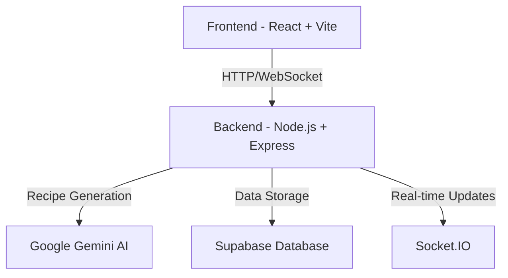

# 🍳 AI-Powered Recipe Generator & Manager

An intelligent recipe management system that leverages AI to generate, customize, and manage your recipes in real-time. Built with modern web technologies and a focus on user experience.


## ✨ Features

- 🤖 **AI-Powered Recipe Generation** - Create custom recipes using Google's Gemini AI
- 🔄 **Real-Time Updates** - See recipe changes instantly with Socket.IO integration
- 💬 **Interactive Chat Interface** - Modify recipes through natural conversation
- 📱 **Responsive Design** - Works seamlessly on desktop and mobile devices
- 🔍 **Smart Search** - Find recipes by ingredients, cuisine, or dietary preferences
- 🎨 **Visual Diff** - See recipe changes with GitHub-style colored diffs
- AI-powered recipe creation with structured output

### Recipe Management
- Save generated recipes to your personal collection
- View detailed recipe information including ingredients and step-by-step instructions
- Delete recipes from your collection
- Rate recipes (1-5 stars)

### Search & Filter
- Search recipes by name or ingredient
- Filter by difficulty level (Easy, Medium, Hard)
- Filter by cuisine type
- Paginated recipe list for better performance

### User Experience
- Fully responsive design (mobile and desktop)
- Clean, modern user interface
- Loading states and error handling
- Form validation with clear feedback

## Architecture

This project follows a **clean, layered architecture** pattern for maintainability and scalability:

### Backend Architecture (MVC + Service Layer)

```
┌─────────────────────────────────────────────────────────┐
│                    Client (Frontend)                     │
└─────────────────────┬───────────────────────────────────┘
                      │ HTTP Requests
                      ▼
┌─────────────────────────────────────────────────────────┐
│                  Express Middleware                      │
│  ┌──────────┐  ┌──────────┐  ┌────────────────────┐   │
│  │  Helmet  │  │   CORS   │  │   Rate Limiter     │   │
│  └──────────┘  └──────────┘  └────────────────────┘   │
└─────────────────────┬───────────────────────────────────┘
                      ▼
┌─────────────────────────────────────────────────────────┐
│                    Routes Layer                          │
│         Defines API endpoints & HTTP methods             │
└─────────────────────┬───────────────────────────────────┘
                      ▼
┌─────────────────────────────────────────────────────────┐
│                 Controller Layer                         │
│  • Request validation (Zod schemas)                      │
│  • Response formatting                                   │
│  • Error handling                                        │
└─────────────────────┬───────────────────────────────────┘
                      ▼
        ┌─────────────────────────────┐
        │                             │
        ▼                             ▼
┌──────────────────┐         ┌──────────────────┐
│  AIService       │         │ RecipeService    │
│ • Prompt Eng.    │         │ • CRUD Ops       │
│ • AI Integration │         │ • DB Queries     │
│ • Response Parse │         │ • Pagination     │
└────────┬─────────┘         └────────┬─────────┘
         │                            │
         ▼                            ▼
┌──────────────────┐         ┌──────────────────┐
│  Google Gemini   │         │    Supabase      │
│   AI (2.5)       │         │   PostgreSQL     │
└──────────────────┘         └──────────────────┘
```

### Request Flow

1. **Client Request** → Express middleware (security, CORS, rate limiting)
2. **Routes** → Map HTTP methods to controller actions
3. **Controller** → Validates input with Zod schemas, handles HTTP concerns
4. **Service Layer** → Business logic (AI generation or database operations)
5. **External Services** → Google Gemini AI or Supabase Database
6. **Response** → Formatted JSON response back to client

## Tech Stack & Justifications

### Backend
- **Node.js with Express.js**: Robust, widely-adopted framework with excellent ecosystem
- **TypeScript**: Type safety reduces bugs and improves developer experience
- **Google Gemini 2.5 Flash**: Latest AI model with excellent structured output and cost-effectiveness
- **Supabase (PostgreSQL)**: Managed database with built-in features like Row Level Security, easy setup, and excellent developer experience
- **Zod**: Type-safe input validation ensuring data integrity
- **Express Rate Limit**: API protection against abuse
- **Helmet.js**: Security headers protection

### Frontend
- **React 19**: Modern, component-based UI library with excellent performance
- **TypeScript**: Type safety throughout the application
- **Vite 7**: Lightning-fast build tool with HMR (Hot Module Replacement)
- **React Router**: Client-side routing for seamless navigation
- **Axios**: Robust HTTP client with interceptors and error handling
- **Tailwind CSS v4**: Utility-first CSS framework for rapid, responsive design

### Design Principles
- **Clean Architecture**: Separation of concerns (routes, controllers, services)
- **RESTful API**: Standard HTTP methods and status codes
- **Type Safety**: Full TypeScript coverage on both frontend and backend
- **Error Handling**: Centralized error middleware with custom error classes
- **Security**: Helmet, CORS, rate limiting, input validation
- **Scalability**: Pagination, efficient database queries with indexes

## Prerequisites

- Node.js (v20.x or higher)
- npm or yarn
- Supabase account
- Google Gemini API key

## Setup Instructions

### 1. Clone the Repository

```bash
cd "AI-Powered Recipe Generator & Manager"
```

### 2. Database Setup (Supabase)

1. Create a Supabase account at [https://supabase.com](https://supabase.com)
2. Create a new project
3. Go to the SQL Editor in your Supabase dashboard
4. Copy the contents of `backend/database/schema.sql`
5. Paste and run the SQL in the SQL Editor
6. Note your project URL and anon key from Settings > API

## 🏗️ System Architecture



### Tech Stack
- **Frontend**: React, TypeScript, Vite, Socket.IO Client
- **Backend**: Node.js, Express, TypeScript, Socket.IO
- **Database**: Supabase (PostgreSQL)
- **AI**: Google Gemini AI
- **DevOps**: Docker, Docker Compose

## 🚀 Quick Start

### Prerequisites
- Node.js 18+ installed
- Docker and Docker Compose (optional)
- Supabase account
- Google Gemini API key

**Environment Variables (backend/.env):**
```env
PORT=3000
NODE_ENV=development

# Google Gemini API
GEMINI_API_KEY=your_actual_gemini_api_key_here

# Supabase Configuration
SUPABASE_URL=your_actual_supabase_url_here
SUPABASE_ANON_KEY=your_actual_supabase_anon_key_here

# Rate Limiting
RATE_LIMIT_WINDOW_MS=900000
RATE_LIMIT_MAX_REQUESTS=100
```

### 4. Frontend Setup

```bash
cd ../frontend

# Install dependencies
npm install

# Create environment file
cp .env.example .env

# Edit .env if you want to change the API URL (default: http://localhost:3000/api)
```

**Environment Variables (frontend/.env):**
```env
VITE_API_BASE_URL=http://localhost:3000/api
```

## Running the Application

### Development Mode

**Terminal 1 - Backend:**
```bash
cd backend
npm run dev
```
The backend server will start on `http://localhost:3000`

**Terminal 2 - Frontend:**
```bash
cd frontend
npm run dev
```
The frontend will start on `http://localhost:5173`

### Production Mode

**Backend:**
```bash
cd backend
npm run build
npm start
```

**Frontend:**
```bash
cd frontend
npm run build
npm run preview
```

## API Endpoints

### POST /api/recipes/generate
Generate a new recipe using AI

**Request Body:**
```json
{
  "ingredients": ["chicken", "tomatoes", "garlic"],
  "dietary_restrictions": ["gluten-free"],
  "cuisine_type": "Italian"
}
```

**Response:**
```json
{
  "status": "success",
  "data": {
    "recipe_id": "uuid",
    "title": "Recipe Name",
    "ingredients": ["ingredient 1", "ingredient 2"],
    "instructions": ["step 1", "step 2"],
    "prep_time": "30 minutes",
    "difficulty": "Medium"
  }
}
```

### GET /api/recipes
Get all saved recipes with pagination

**Query Parameters:**
- `page` (optional): Page number (default: 1)
- `limit` (optional): Items per page (default: 10)

### GET /api/recipes/:id
Get a specific recipe by ID

### POST /api/recipes/:id/save
Save a generated recipe to the database

**Request Body:** Recipe object

### DELETE /api/recipes/:id
Delete a recipe from the database

### POST /api/recipes/:id/rate
Rate a recipe

**Request Body:**
```json
{
  "rating": 5
}
```

## 🛠️ Development

### Project Structure
```
├── backend/                # Node.js + Express backend
│   ├── src/
│   │   ├── controllers/   # Request handlers
│   │   ├── services/      # Business logic
│   │   ├── routes/        # API routes
│   │   └── utils/         # Helper functions
│   └── ...
├── frontend/              # React + Vite frontend
│   ├── src/
│   │   ├── components/    # Reusable UI components
│   │   ├── pages/        # Page components
│   │   └── api/          # API integration
│   └── ...
└── docker-compose.yml     # Docker services configuration

## 💡 How It Works

1. **Recipe Generation**
   - Users input their recipe preferences or requirements
   - Gemini AI generates a detailed recipe based on the input
   - Real-time streaming of AI responses for instant feedback

2. **Recipe Management**
   - Save generated recipes to your personal collection
   - Edit recipes through a chat interface
   - See changes in real-time with colored diffs
   - Search and filter your recipe collection

3. **Real-Time Updates**
   - Socket.IO enables instant updates across devices
   - Changes are reflected immediately for all users
   - Collaborative editing with visual feedback

## Special Features & Implementation Details

### 1. Smart AI Prompt Engineering
The `AIService` uses carefully crafted prompts that:
- Request **JSON-only responses** for reliable parsing
- Include context about dietary restrictions and cuisine preferences
- Handle markdown code block responses automatically with cleanup logic
- Generate detailed, step-by-step cooking instructions
- Specify structured format to ensure consistent output

### 2. Dual-Layer Rate Limiting
- **Global API Rate Limit**: 100 requests per 15 minutes per IP (configurable)
- **Recipe Generation Limit**: 10 requests per minute per IP
- Prevents AI API abuse and manages costs
- Returns standardized error messages

### 3. Comprehensive Error Handling
- **Custom AppError class** for application-specific errors with status codes
- **Zod validation error formatting** for user-friendly field-level errors
- **Centralized error middleware** catches all errors in one place
- **Graceful error responses** with consistent JSON format
- **Detailed logging** for debugging without exposing internals to users

### 4. Smart Response Parsing
The AI service handles multiple response formats automatically:
- Clean JSON responses
- JSON wrapped in markdown code blocks (```json)
- Automatic text cleanup and validation
- Error recovery with detailed logging

### 5. Advanced Search & Filter System
- **Real-time client-side search** by recipe title (instant results)
- **Multi-filter support**: cuisine type, difficulty, dietary restrictions
- **Efficient pagination** for large recipe collections
- **Optimized database queries** with indexes on `recipe_id`, `created_at`, and `cuisine_type`
- **SQL query optimization** for fast filtering

### 6. Full Type Safety
- **100% TypeScript** coverage on both frontend and backend
- **Shared type definitions** between client and server
- **Runtime validation** with Zod schemas
- **Compile-time type checking** prevents bugs before runtime
- **Explicit .ts extensions** for ESM module compatibility

### 7. Security Best Practices
- **Helmet.js** for secure HTTP headers (XSS, clickjacking protection)
- **CORS configuration** for cross-origin security
- **Environment variable management** for secrets
- **Input validation and sanitization** on all endpoints
- **SQL injection prevention** via Supabase parameterized queries
- **Row Level Security (RLS)** ready for future authentication

### 8. Modern UI/UX
- **Mobile-first responsive design** with Tailwind CSS
- **Loading states** with spinner component
- **Success/error notifications** with auto-dismiss
- **Modal dialogs** for detailed recipe views
- **Smooth animations** and transitions
- **Accessibility features** (semantic HTML, ARIA labels)

### 9. Database Optimizations
- **Automatic timestamps** with triggers (`updated_at`)
- **Indexed columns** for fast lookups and sorting
- **UUID primary keys** for better security and distribution
- **Array data types** for ingredients and instructions
- **Constraint validations** (rating range 1-5)

### 10. Development Experience
- **Hot Module Replacement (HMR)** with Vite for instant feedback
- **Nodemon** for automatic backend restarts
- **TypeScript path mapping** for clean imports
- **ESLint configuration** for code quality
- **Consistent code formatting** across the project

## Future Enhancements

### Bonus Features (To Implement)
- [ ] Streaming responses for real-time recipe generation
- [ ] Recipe modification ("make it spicier", "reduce calories")
- [ ] Recipe image generation using DALL-E or Stable Diffusion
- [ ] Chat interface to refine recipes
- [ ] User authentication and multi-user support
- [ ] Recipe sharing and social features
- [ ] Nutritional information
- [ ] Shopping list generation
- [ ] Recipe collections/categories
- [ ] Export recipes to PDF
- [ ] Voice input for ingredients

## Troubleshooting

### Backend won't start
- Check that all environment variables are set correctly
- Ensure Supabase URL and API key are valid
- Verify Gemini API key is active

### Frontend can't connect to backend
- Ensure backend is running on port 3000
- Check VITE_API_BASE_URL in frontend/.env
- Verify CORS is enabled in backend

### Database errors
- Ensure you've run the schema.sql in Supabase
- Check Supabase dashboard for database status
- Verify Row Level Security policies are active

### Recipe generation fails
- Verify Gemini API key is valid and has quota
- Check backend logs for specific errors
- Ensure ingredients array is not empty

## License

MIT

## Contributing

Pull requests are welcome! For major changes, please open an issue first to discuss what you would like to change.

## Support

For issues or questions, please create an issue in the repository.
