---

# 🍳 AI-Powered Recipe Generator & Manager

> *Intelligent. Interactive. Instant.*
> An AI-driven recipe management platform that generates, customizes, and manages culinary creations in real-time — powered by **Google Gemini 2.5 Flash** and **Supabase**.

---

## 🌟 Overview

This project combines **Generative AI**, **modern full-stack architecture**, and **clean UX design principles** to deliver a smart recipe assistant that *thinks and adapts like a chef*.


---

## 🚀 Key Features

### 🤖 **AI Intelligence**

* Generate recipes dynamically using **Google Gemini 2.5 Flash**
* Structured JSON output for seamless front-end rendering
* Context-aware recipe modifications via prompt engineering

### 💬 **Interactive Management**

* Real-time updates with **Socket.IO**
* Edit recipes conversationally
* Visual diff for recipe modifications (GitHub-style change view)

### 🧭 **Smart Search & Filter**

* Search by ingredients, cuisine, or name
* Filter by difficulty, cuisine type, or diet
* Paginated queries with Supabase indexes

### 🧩 **User Experience**

* Responsive, mobile-first UI (Tailwind CSS v4)
* Clean UX with skeleton loaders, toast notifications, and modals
* Zod-based validation for reliable user input handling

---

## 🧠 System Architecture

### ⚙️ **High-Level Overview**

```mermaid
graph TD
    U[👩‍🍳 User] -->|Prompt Input| FE[💻 React Frontend]
    FE -->|API Request| BE[🧠 Express + Node.js Backend]
    BE -->|Generate Recipe| AI[🤖 Google Gemini 2.5 Flash]
    BE -->|Store & Retrieve Data| DB[(🗄️ Supabase PostgreSQL)]
    BE -->|Notify| RT[⚡ Socket.IO Real-time Channel]
    RT --> FE
```



---

### 🧱 **Backend Architecture (Clean MVC + Service Layer)**


---

### 🧩 **Request Flow Summary**


---

## 🧬 Tech Stack

| Layer          | Technology                     | Purpose                           |
| -------------- | ------------------------------ | --------------------------------- |
| **AI**         | Google Gemini 2.5 Flash        | Recipe generation & NLP reasoning |
| **Backend**    | Node.js, Express, TypeScript   | API, business logic, routing      |
| **Database**   | Supabase (PostgreSQL)          | Recipe storage & querying         |
| **Frontend**   | React 19, Vite 7, Tailwind CSS | Interactive UI                    |
| **Validation** | Zod                            | Schema & runtime type validation  |
| **Realtime**   | Socket.IO                      | Instant updates and sync          |
| **Security**   | Helmet, CORS, Rate Limiter     | API hardening                     |

---

## 🧰 Project Structure

```bash
├── backend/
│   ├── src/
│   │   ├── controllers/   # HTTP logic
│   │   ├── services/      # Business logic
│   │   ├── routes/        # Endpoints
│   │   └── utils/         # AI & helper utilities
│   └── ...
├── frontend/
│   ├── src/
│   │   ├── components/    # UI components
│   │   ├── pages/         # Application pages
│   │   └── api/           # Axios calls
└── docker-compose.yml
```

---

## 🧩 Backend Flow in One Look


---

## ⚙️ Setup Instructions

### Prerequisites

* Node.js (v20+)
* Supabase account
* Gemini API Key

### Environment File (`backend/.env`)

```env
PORT=3000
NODE_ENV=development

GEMINI_API_KEY=your_gemini_api_key_here
SUPABASE_URL=your_supabase_url_here
SUPABASE_ANON_KEY=your_supabase_anon_key_here
```

### Installation

```bash
# Backend
cd backend
npm install
npm run dev

# Frontend
cd frontend
npm install
npm run dev
```

---

## 🧪 API Endpoints

| Method   | Endpoint                | Description             |
| -------- | ----------------------- | ----------------------- |
| `POST`   | `/api/recipes/generate` | Generate recipe from AI |
| `GET`    | `/api/recipes`          | Get all saved recipes   |
| `GET`    | `/api/recipes/:id`      | Get recipe by ID        |
| `DELETE` | `/api/recipes/:id`      | Delete recipe           |
| `POST`   | `/api/recipes/:id/rate` | Rate a recipe (1-5)     |

---

## 🧠 Prompt Engineering Logic

* Enforces **structured JSON output**
* Handles markdown-wrapped responses gracefully
* Adds context:

  * Cuisine type
  * Dietary restrictions
  * Ingredient list
  * Step-by-step clarity

---

## 🧱 Security & Reliability

| Feature       | Tool                 | Purpose                 |
| ------------- | -------------------- | ----------------------- |
| Rate Limiting | `express-rate-limit` | API abuse prevention    |
| Helmet        | `helmet`             | Secure HTTP headers     |
| CORS          | `cors`               | Restrict origins        |
| Validation    | `zod`                | Input sanitization      |
| DB Security   | RLS                  | Data isolation per user |

---

## 🛠️ Development Highlights

* **Type-safe end-to-end**
* **Shared model types between backend & frontend**
* **Centralized error middleware**
* **Streaming-ready architecture for real-time AI outputs**
* **Dockerized environment for consistency**

---

## 🧮 Future Enhancements

* [ ] Streaming AI response tokens for live recipe updates
* [ ] Voice-based interaction
* [ ] Multi-user authentication
* [ ] Recipe image generation (Gemini or Stable Diffusion)
* [ ] Nutritional info and calorie breakdown
* [ ] Export to PDF & shopping list generation

---

## 🧾 License

MIT © 2025 [Aayush Kumar](https://github.com/aayushdebugging)

---

## 🧑‍💻 Contributing

Pull requests are welcome!
For major changes, open an issue first to discuss improvements.

---

## 🌐 Support

Having trouble?
Create an issue or reach out via [GitHub Issues](https://github.com/aayushdebugging/Capillary-Technologies/issues)
